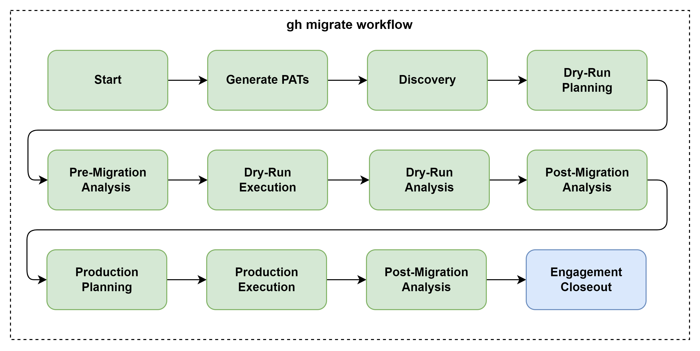
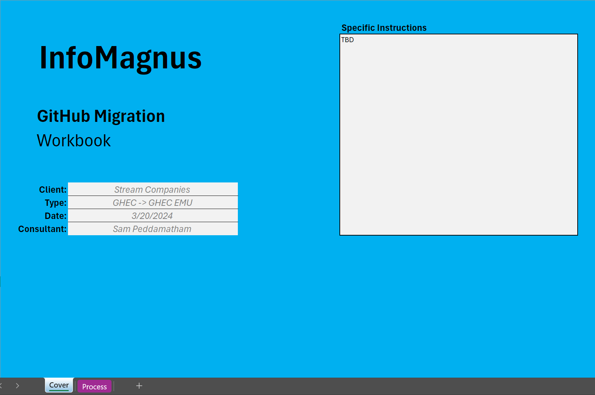
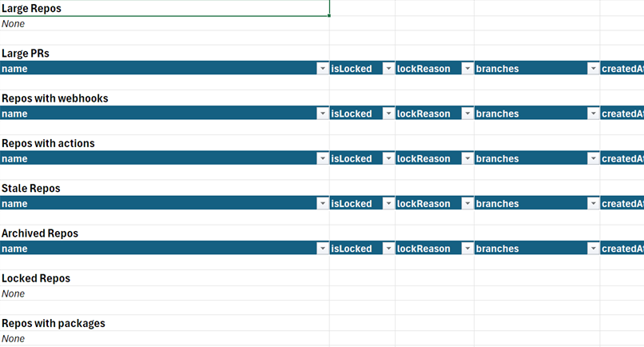
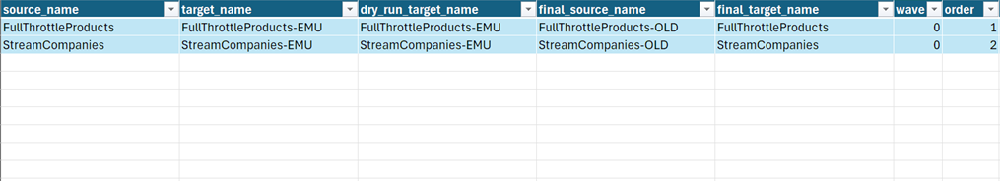
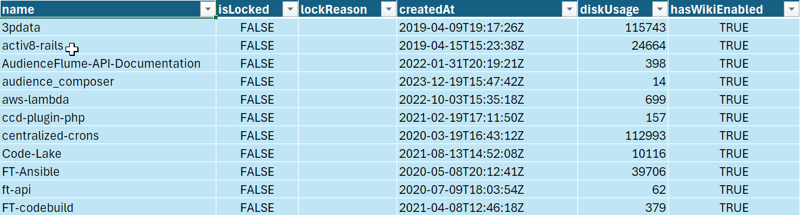

# InfoMagnus GitHub Migration Automator CLI

The InfoMagnus GitHub Migration Automator is a GitHub CLI-based tool designed to help you plan and execute GitHub-to-GitHub migrations.

## The Process



## Commands

`gh migrate` consists of the following commands:
- `start` - Creates a migration workbook
- `stats` - Captures stats on the source/target environments
- `load` - Load `.csv` files into migration workbook
- `get logs` - Download migration logs
- `report` - Generate reports

## Philosophy

GitHub migrations require managing large amounts of data: inventories, plans, logs and scripts.

The `gh migrate` workflow helps you by eliminating the overhead of managing data, allowing you to focus on what's important - planning, communicating, and executing.

The workflow uses pre-defined filepaths and version control to manage data across the pre-migration, dry-run(s), and production migration(s) phases.

The workflow creates a branch named `engagement`, which all steps work out of.

Each command generates a well-named commit, which helps you capture the evolution of your data throughout the engagement.


## Usage

**NOTE:** This tool is meant to be run in a Visual Studio Code devcontainer or GitHub Codespaces.

During an engagement the tool is used as follows:

### Step 1: Start

Begin a migration by forking this repository and `git clone`'ing a local copy.

Then:
1. Open the repository in Visual Studio Code
1. Open the devcontainer
1. Log in to your InfoMagnus GitHub account using `gh auth login` (use the web browser option)
1. Install `gh-migrate` using `gh extension install im-infomagnus/gh-migrate`
1. Install `gh-gei` using `gh extension install github/gh-gei`
1. Create a migration workbook using `gh migrate start`

The initialized workbook is placed in `report/InfoMagnus - Migration Workbook.xlsx`.

The "migration workbook" is an Excel workbook which all subsequent `gh migrate` workflows operate around.  It is your sole data repository and planning tool to complete the migration.

The migration workbook will contain two sheets:
1. `Cover`: Used to capture initial high-level information about the engagement
2. `Process`: Client-facing overview of the migration processes




### Step 2: Generate source / target organization PATs

Personal Access Tokens (PATs) for both the source and target enterprise are required to use `gh migrate`.

Process:
1. Work with your client to generate tokens: [required perms](docs/personal-access-tokens.md)
1. Store the tokens in your [Bitwarden](https://bitwarden.com/) repository
1. Copy `.env.pats-TEMPLATE` to `.env.pats` and add tokens

**Note:** Always store the token expiration date along with the token.  This helps make sure you aren't surprised by expired tokens during critical stages in the migration process.

### Step 3: Discovery

Now that we have the PATs, we can begin discovery of the source (and target) environments.

#### Source Environment(s)

To generate inventories of the source enterprise, type:

```bash
gh migrate stats --before --source \
    --org source-org1 \
    --org source-org2 \
    ...
    --wave 0 \
    --pat <source-org-PAT>
```

After the stats are gathered, the following files will be created:

```bash
/logs/before-source-wave-0.csv
```

**Note:** This is the only time you'll have to type out all of the source organization names.


#### Target Environment(s)

If the target enterprise is an existing, production environment, then it's important to generate an inventory of it.

This serves as a snapshot and baseline of the client's landscape prior to our engagement.  It is also useful in debugging, triaging, or even rolling-back an engagement.

```bash
gh migrate stats --before --target \
    --org target-org1 \
    --org target-org2 \
    ...
    --wave 0 \
    --pat <target-org-PAT>
```

After the stats are gathered, the following files will be created:

```bash
/logs/before-target-wave-0.csv
```

**Note:** This is the only time you'll have to type out all of the target organization names.


### Step 4: Dry-Run Planning

With the inventories gathered, we can begin planning the dry-run.

To update the migration workbook with the inventory:

```bash
gh migrate load inventory
```

**Note:** The `load inventory` command assumes the existence of the `before-source-wave-0.csv` (and `before-target-wave-0.csv` generated in the prior step).

This will create three new sheets:
- Pre-migration Report
- Mapping - Org
- Mapping - User
- Inventory - Source Repos
- Inventory - Target Repos (optional)

#### Pre-migration Report



The pre-migration report is used to identify the following repositories that are:
- Problematic based on our past engagements
    - larger than 5GB
    - with more than 10,000 PRs
    - ...
- Use features that are not migrated
    - so we can send targetted coms to repo-owners
- Not actively used
    - these can be migrated first, as they are relatively low-risk

For more details see...

#### Mapping - Org

The organization mapping table is where you configure the migration tool.



This is where you specify and document the following:
- `source_name`: name(s) of source org(s)
- `target_name`: name(s) of target org(s) for the production migration(s)
- `dry_run_target_name`: name(s) of target org(s) for the dry-run migration(s)
- `final_source_name`: name(s) of source org(s) ***after*** the production migration(s)
- `final_target_name`: name(s) of target org(s) ***after*** the production migration(s)
- `wave`: used to group together orgs into multiple waves
- `order`: used to define the order of orgs within each wave

**Note:** All subsequenct steps of the process use what you've defined here to generate filenames and script names.

#### Inventory - Source/Target Repos

Contains the initial inventories of the source and target orgs.



### Step 6: Pre-Migration Analysis Meeting

Now that you have a "Pre-Migration Report", schedule a review meeting with the client.

The goal of this meeting is:
- Review the Pre-Migration Report
- Set expectations for the dry-run and production migrations based on the review


#### Large Repos
- Clean repos?
- Use GitLFS?
- Delete some commits?

#### Large PRs
- Delete them?
- ???

#### Repos with Packages

Let the client know that gh gei doesn't support packages. Develop a plan.

#### Archived / Locked Repos

This repos are an opportunity for a quick-win. Archived repos, by definition, aren't actively in use.

See if you can schedule these for immediate migration.

#### Repos with Actions

Discuss testing

#### Repos with Webhooks

Discuss that webhooks are disabled during migration and have to be manually enabled.
Discuss need to understand external dependencies.

---

During this meeting, update the 'Mapping - Org' table to reflect which organizations will be in-scope for the migration.

If you have unusually large organizations, bundle them.

If not, make them all part of wave 0.

### Step 7: Dry-Run Execution

Once you've identified which organizations will be part of the dry-run, you can generate the dry-run migration scripts:

```bash
gh migrate scripts migration --dry-run --wave 0
```

The dry-run script(s) are placed in `scripts/`, and look like:

```bash
#!/bin/bash

source .env.pats

##########################################
# Capture pre-migration source stats
##########################################

gh migrate stats --before --source --dry-run --wave 0 --pat ${source_pat}
gh migrate snapshots --before --source --dry-run --wave 0 --pat ${source_pat}

##########################################
# Migrate!
##########################################
gh gei migrate-org \
    --github-target-enterprise ${target_slug} \
    --github-source-org ProconGPS \
    --github-target-org ProconGPS-DRYRUN-RETRY \
    --github-source-pat ${source_pat} \
    --github-target-pat ${target_pat} \
    --queue-only \
    --verbose

##########################################
# Capture post-migration source stats
##########################################
gh migrate stats --after --source --dry-run --wave 0 --pat ${source_pat}

##########################################
# Capture post-migration target stats
##########################################
gh migrate stats --after --target --dry-run --wave 0 --pat ${target_pat}
gh migrate snapshots --after --target --dry-run --wave 0 --pat ${target_pat}

# ##########################################
# # Get migration logs
# ##########################################
gh migrate get logs --dry-run --wave 0 --pat ${target_pat}

# ##########################################
# # Cleanup
# ##########################################
export GITHUB_TOKEN=${target_pat}
gh repo delete \
    ProconGPS-DRYRUN/gei-migration-results

# ##########################################
# # Generate post-migration scripts
# ##########################################
gh migrate scripts post-migration --dry-run --wave 0

# ##########################################
# # Pause and ask for confirmation
# ##########################################
read -p "Please confirm the migration workbook is closed (Y/N): " confirmation

# ##########################################
# # Generate post-migration report
# ##########################################
gh migrate report --dry-run --wave 0

echo "*** Migration activities completed.  Begin post-migration activities ***"
echo ""
echo "Once complete:"
echo "1. Update 'Mapping - Org' to reflect the final source_name and target_name."
echo "2. Run gh migrate scripts migration --final --wave 0 to generate final report."
```

Before running the script, you must create an `.envs.pats` file containing the following:
```bash
export source_pat=<source pat>
export target_pat=<target pat>
export target_slug=<target slug>
```

---

After the dry-run completes, the following files will be created:

```bash
/logs/dry-run/before-source-wave-0.csv
/logs/dry-run/after-source-wave-0.csv
/logs/dry-run/after-target-wave-0.csv
```

These files contain the before/after statistics for the migrated organizations.


After the dry-run completes, the following directories will be created:

```bash
/logs/dry-run/target-org1-DRYRUN
/logs/dry-run/target-org2-DRYRUN
```
These directories contain the, GEI migration logs.

---

And the migration workbook will contain:
- Dry-Run Report
- Dry-Run Repo Results
- Dry-Run Org Results


For more detail on the process see: [link](docs/migration-process.md)

### Step 8: Dry-Run Analysis

The dry-run analysis phase is where we determine what went well and what didn't.

#### Dry-Run Report

This report contains a diff of all of the source and target system stats.

Review the report to identify discrepancies.

#### Dry-Run Repo Results

This report contains any repository-level warnings or errors emitted by the GEI migration tool.

Review them to identify any showstopping errors and warnings.

#### Dry-Run Org Results

This report contains any organization-level warnings or errors emitted by the GEI migration tool.

Review them to identify any showstopping errors and warnings.


### Step 9: Post-Migration Analysis Meeting

After the dry-run(s) are complete, schedule a meeting with your client to review the Dry-Run Reports.

TBD

### Step 10: Production Planning Meeting

TBD

### Step 11: Production Migration Execution

TBD

`gh migrate scripts migration --final --wave n`

### Step 11: Engagement Closeout

TBD

## FAQ

- When an organization is migrated using `gh gei migrate-org` team-to-repository permissions are migrated
- Internal Migration checklist [link](https://infomagnus365.sharepoint.com/:w:/s/GitHub/EfJtgfDufIlPuufsWAbnREcBumid3qCHBaUFPFhfHgFO1g?e=WkguD3)
- GitHub Migration Guidance (LEGACY) [link](https://github.github.com/enterprise-migrations/#/./0-about)
- GitHub Enterprise Importer GEI [link](https://github.com/github/gh-gei)
- GitHub Migration Analyzer [link](https://github.com/github/gh-migration-analyzer)
  - Can be handed over to the customer for collecting repo inventory
- GitHub Action Importer [link](https://github.com/github/gh-actions-importer)
  - Can be handed over to the customer to run the audit and provide results of GAI audit for analysis
  
## Contributing
See [CONTRIBUTING.md](docs/CONTRIBUTING.md)

## License
[Specify the license under which the tool is distributed]

## Contact
[Provide contact information for support or inquiries]

## TODO

- Use GitHub Status API to check for scheduled outages: https://www.githubstatus.com/api
